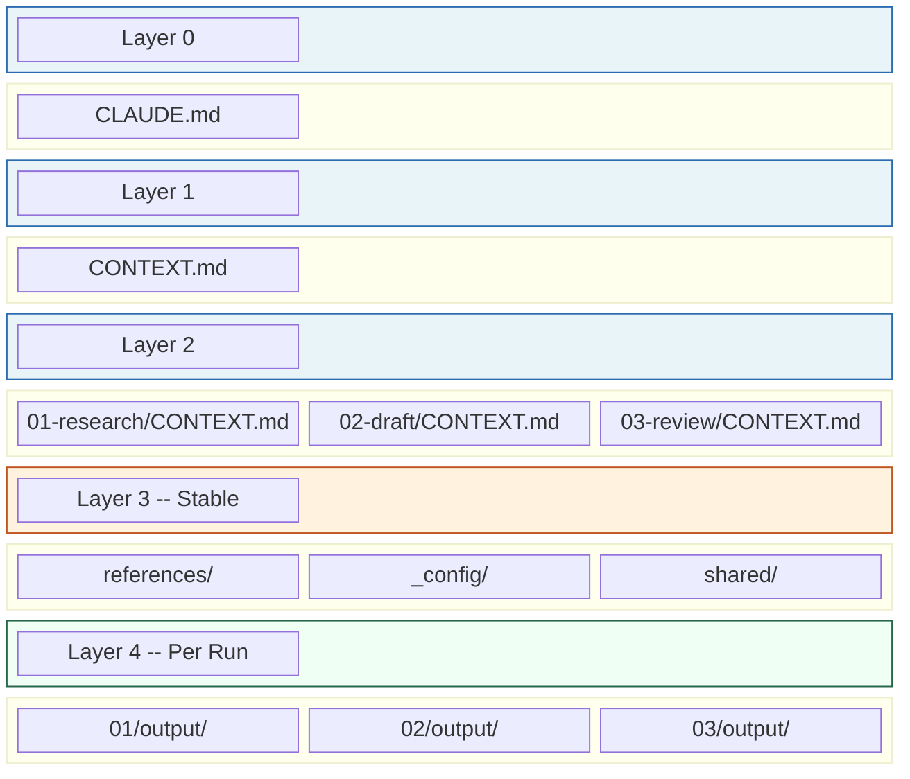
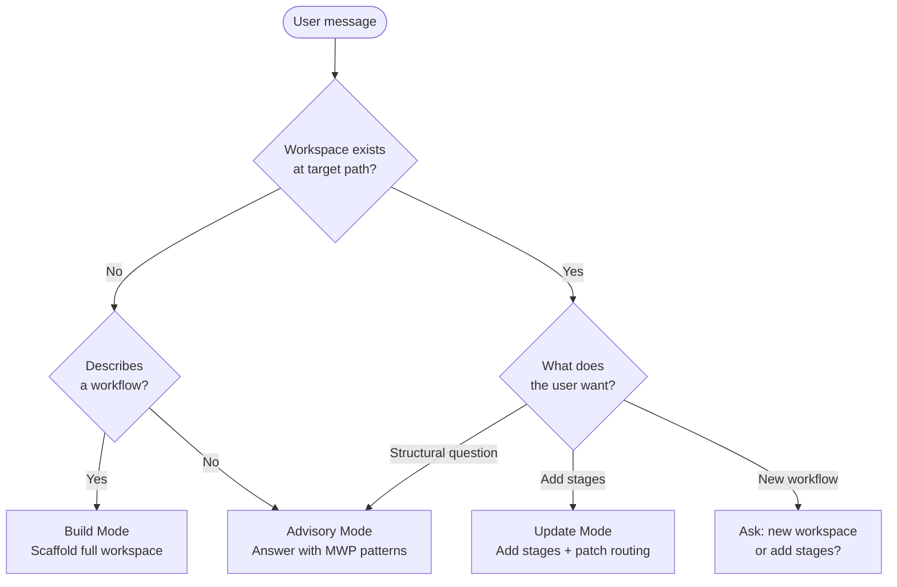
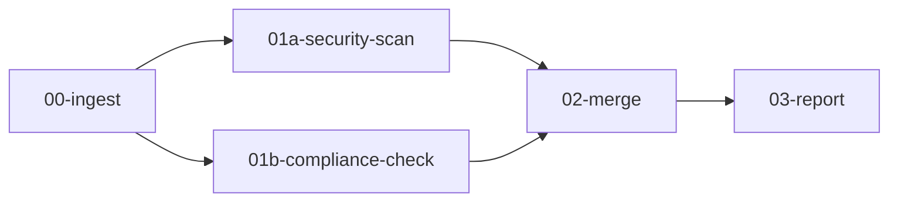

# ICM Workspace Builder

A Claude Code skill that scaffolds structured, multi-stage AI workspaces using the Interpretable Context Methodology (ICM).

## What it does

ICM Workspace Builder turns workflow descriptions into numbered-folder workspaces where each stage has one job, loads only the context it needs, and passes work forward through manifest-based handoffs. No framework, no orchestration runtime -- just folders, markdown, and a context hierarchy.

## Five-Layer Context Architecture

Each workspace organises information into five layers. The agent loads only the layers relevant to the current stage -- typically 2,000-8,000 tokens instead of the entire workspace.



| Layer | Loads | Changes between runs? |
|-------|-------|----------------------|
| 0 -- Identity | `CLAUDE.md` | No |
| 1 -- Routing | `CONTEXT.md` | No |
| 2 -- Stage contract | `stages/0N/CONTEXT.md` | No |
| 3 -- Reference | `references/`, `_config/`, `shared/` | No (set at setup) |
| 4 -- Working artifacts | `stages/0N/output/` | Yes (each run) |

## How stages pass work forward

Stages form a one-way pipeline. Each stage reads the previous stage's manifest to discover exact filenames, does its job, writes output, and updates pipeline state.

```mermaid
flowchart LR
    subgraph Stage 1
        A1[Read _config/] --> A2[Do work]
        A2 --> A3[Write output/manifest.md]
    end

    subgraph Stage 2
        B1[Read Stage 1 manifest] --> B2[Load listed artifacts]
        B2 --> B3[Do work]
        B3 --> B4[Write output/manifest.md]
    end

    subgraph Stage 3
        C1[Read Stage 2 manifest] --> C2[Load listed artifacts]
        C2 --> C3[Do work]
        C3 --> C4[Write output/manifest.md]
    end

    A3 -->|manifest| B1
    B4 -->|manifest| C1
```



## Mode detection

The skill operates in three modes based on what you ask and whether a workspace already exists.



## Parallel branches

When stages can run independently, they share the same number with letter suffixes. A merge stage at the next number synthesises both.



## What gets generated

A typical Build produces:

```
my-workspace/
├── CLAUDE.md                        # Layer 0 -- identity + routing
├── CONTEXT.md                       # Layer 1 -- task routing table
├── _config/
│   ├── workspace-config.md          # Layer 3 -- setup answers
│   └── pipeline-state.md            # Stage status tracker
├── shared/                          # Layer 3 -- cross-stage utilities
├── setup/
│   └── questionnaire.md             # One-time onboarding
└── stages/
    ├── 01-ingest/
    │   ├── CONTEXT.md               # Layer 2 -- stage contract
    │   ├── references/              # Layer 3 -- stage-specific refs
    │   └── output/                  # Layer 4 -- run artifacts
    ├── 02-draft/
    │   ├── CONTEXT.md
    │   ├── references/
    │   └── output/
    └── 03-review/
        ├── CONTEXT.md
        ├── references/
        └── output/
```

## Install

Copy the skill into your Claude Code skills directory:

```bash
cp -r icm-workspace-builder ~/.claude/skills/
```

Or clone and symlink:

```bash
git clone https://github.com/znoevil/icm-workspace-builder.git
ln -s "$(pwd)/icm-workspace-builder" ~/.claude/skills/icm-workspace-builder
```

## Usage

Inside Claude Code, invoke the skill by asking it to build a workspace:

> "Build me a workspace for weekly threat intelligence digests -- ingest raw clips, research context, draft a brief, review, and distribute."

Or ask structural questions:

> "Should this be one stage or two?"
> "Where does this config file belong?"

## Patterns

The skill implements 22 MWP patterns documented in `references/mwp-conventions.md`:

| # | Pattern | Purpose |
|---|---------|---------|
| 1 | Stage Contracts | Inputs/Process/Outputs structure for every stage |
| 2 | Stage Handoffs | Output folders + manifest-based file discovery |
| 3 | One-Way References | No back-references; downstream reads upstream only |
| 4 | Selective Section Routing | Reference specific sections, not whole files |
| 5 | Canonical Sources | Every fact has one home; no duplication |
| 6 | CONTEXT.md = Routing | Never contains actual content; routes to it |
| 7 | Tool Prerequisites | Scripts in `references/` or `shared/` |
| 8 | Questionnaire Design | Flat, all-at-once, derive what you can |
| 9 | Bundled Skills | Claude Code skills inside the workspace |
| 10 | Specs Are Contracts | WHAT and WHEN, not HOW |
| 11 | Checkpoints | Human steering between creative steps |
| 12 | Stage Audits | Self-check before writing to output |
| 13 | Value Validation | Agree on value types before creating |
| 14 | Docs Over Outputs | Reference docs are authoritative, not past outputs |
| 15 | Shared Constants | Colors, fonts, timing defined once |
| 16 | Stage Manifests | Every stage writes manifest.md; skips write "skipped" |
| 17 | Pipeline State | Central status table in `_config/` |
| 18 | Parallel Branches | Letter-suffixed stages + merge stage |
| 19 | Autonomy Flag | `guided` vs `autonomous` execution mode |
| 20 | Critique Stage | Evaluate output against codified criteria |
| 21 | Knowledge Base | Compiled wiki from raw intake documents |
| 22 | Deliverables Stage | Reshape markdown into docx/xlsx/pptx |

## Attribution

Based on the Interpretable Context Methodology (ICM) by Van Clief & McDermott, 2025.

## License

MIT
