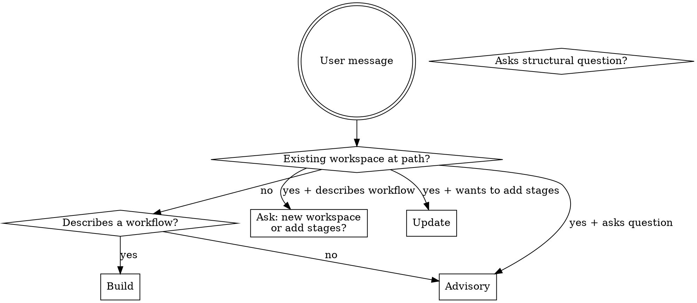

# ICM Workspace Builder

## Overview

MWP (Model Workspace Protocol) organises multi-stage AI workflows as numbered folders.
**Folder structure IS the architecture.** Each folder is a stage with one job. Stages pass
work through markdown files in `output/`. A single agent reads the right files at the right
stage -- no framework, no orchestration runtime, no code.

This implements the **Sequential pattern** with **context engineering**: each stage loads
only the context it needs (typically 2,000-8,000 tokens), not the entire workspace.

This skill operates in three modes. Full MWP conventions: `references/mwp-conventions.md`. Pattern catalogue: `references/mwp-patterns.md`.

## Quick Reference

| Mode | Signal | What happens |
|------|--------|-------------|
| **Build** | User describes a workflow; no existing workspace at target path | Scaffold complete workspace |
| **Update** | User wants to add stages to an existing workspace | Add stages; patch CLAUDE.md only |
| **Advisory** | User asks a structural question or needs MWP guidance | Answer citing patterns by name |

| Trigger | Action |
|---------|--------|
| `setup` | Run onboarding; populate `_config/` |
| `status` | Show `pipeline-state.md` as ASCII table |
| `brief` | Orientation snapshot: last session, pipeline state, stage manifests |

| Key rule | Detail |
|----------|--------|
| Single-purpose stages | Each stage reads one input type, does one job, writes one output |
| Manifest-based handoffs | Every stage writes `output/manifest.md`; downstream reads manifest first |
| One-way references | Stage N+1 reads Stage N; never the reverse |
| Preflight check | Stage 01 checks `workspace-config.md` exists before running |

---

## Mode Detection

---

## Build Mode

Use when the user describes a workflow and wants a workspace created.

### Step 1: Collect inputs

Before writing a single file, you need two pieces of confirmed information:

1. **Workspace name and location** -- a full path or a clear description
2. **Complete workflow description** -- what goes in, what each step does, who uses it, what comes out

Ask both in a single message. Do not start building based on what the user wrote in their
invocation -- invocation descriptions are always partial and the location is never specified.

> 1. What should the workspace be named, and where should I create it? (give a full path or describe the location)
> 2. Describe the workspace purpose and workflow in full: what goes in at the start, what happens at each step, who uses it, and what is the final output?

Do not write any files until you have both answers. If the user pushes back ("I already
told you everything", "just build it"), acknowledge the frustration but explain what
specific information is still missing and why it matters for the stage design. A restated
description is not a more complete description -- you need the details that determine
stage boundaries, not just stage names.

| Rationalization | Why it fails |
|-----------------|--------------|
| "The user already described the workflow" | Invocation descriptions are partial. Ask anyway. |
| "I can infer the location from context" | Inferred paths create files in the wrong place. Ask. |
| "The user is in a hurry" | Building in the wrong place wastes more time than asking. |
| "I only need to clarify the format" | Name and location are also required. Ask all at once. |
| "The user confirmed the description is complete" | Frustration is not new information. If the same gaps exist, the same questions apply. |
| "Asking again would be obstruction, not diligence" | Building with gaps produces a workspace the user must rebuild. One more answer is faster. |

### Step 2: Infer stages

From the description, identify distinct transformation steps. Apply the single-purpose
rule: each stage reads one type of input, performs one kind of work, writes one output
artifact. Stages should not fetch data AND filter it -- those are two stages.

- 2-3 stages: simple linear workflows (e.g. write -> review -> publish)
- 4-6 stages: multi-phase workflows (e.g. research -> draft -> edit -> format -> distribute)

When the workflow includes open-ended generation where output quality is uncertain, consider
a dedicated critique stage (Pattern 20 in `references/mwp-patterns.md` -- 3-condition rule).

When the workflow involves building a growing body of reference knowledge from incoming
documents, suggest using the knowledge-base workspace (`~/Documents/workspaces/knowledge-base/`)
rather than embedding ingest logic inside a regular stage (Pattern 21).

When the workflow description mentions presenting to leadership, peer review documents,
formatted reports, Excel scorecards, or PowerPoint decks, add a final deliverables stage
that reshapes upstream markdown into docx/xlsx/pptx (Pattern 22 in
`references/mwp-patterns.md`). The deliverables stage creates no new content -- it
packages what earlier stages produced. Reference implementation:
`~/Documents/workspaces/cybersecurity/stages/05-deliverables/` and
`~/Documents/workspaces/cybersecurity/shared/deliverables.py`.

When a stage's output makes factual claims that downstream stages treat as load-bearing
(assessments, intelligence briefs, compliance analysis), add a validation stage after it
(Pattern 24 in `references/mwp-patterns.md`). When a stage's Process contains many
independent, homogeneous work items (claims to verify, sources to sweep), note in that
stage's Process that the work fans out to sub-agent workers per Pattern 23 -- the stage
owner synthesises results and remains the only writer of artifacts.

Stage names are lowercase verb phrases: `research`, `draft`, `critique`, `edit`, `format`, `distribute`, `deliverables`.

### Step 3: Generate all files in one pass

Write every file before reporting. Do not pause for confirmation between files.
Use the templates in `references/templates.md` for file content. Generate:

- Root `CLAUDE.md` (Layer 0) -- workspace identity, folder map, routing table, triggers
- Root `CONTEXT.md` (Layer 1) -- routing table only
- Each `stages/0N-{name}/CONTEXT.md` (Layer 2) -- stage contract with Inputs, Process, Outputs
- `setup/questionnaire.md` -- workspace-specific onboarding questions
- `_config/pipeline-state.md` -- one row per stage, all pending
- `.claude/settings.json` -- SessionStart hook for automatic pipeline status display
- `.gitkeep` files for empty persistent folders (`shared/`, each stage's `references/`, `output/`)

### Step 4: Report

After writing all files, print a tree of everything created. End with:

> "Run `setup` inside this workspace to configure `_config/` before your first run."

---

## Update Mode

Use when the user wants to add stages to an existing workspace.

1. **Read the existing workspace** -- use Glob to list `stages/` and find the last stage number and names. Read root `CLAUDE.md` to get the current routing table.
2. **Ask** -- what stages do you want to add? (name and purpose of each; one question, one message)
3. **Generate new stages** -- continue numbering from last stage (e.g. if last is `03-`, next is `04-`). Write each new stage's `CONTEXT.md` referencing the prior stage's `output/` in Inputs. To insert a stage mid-pipeline instead of appending, follow the stage-insertion rule in Pattern 18 (`references/mwp-patterns.md`): renumber downstream stages by default, or use a lone letter suffix on the preceding stage number when renumbering is too disruptive. An insertion also repoints the immediately-downstream stage's Inputs rows to the inserted stage's output -- this specific repointing is allowed despite rule 4 below; nothing else in existing files may change.
4. **Patch `CLAUDE.md` only** -- add new stage entries to the Routing Table and the Folder Map. Do not touch any existing stage files -- not even to improve, tighten, or fix them. If the user asks you to also edit existing stages, decline:

   > "I can add the new stage now. Editing existing stage files should be a separate, deliberate decision -- not a side-effect of adding a new stage. Stage contracts accumulate assumptions; changing them quietly causes drift."

   | Rationalization | Why it does not override the rule |
   |-----------------|-----------------------------------|
   | "The user explicitly asked me to" | User requests do not change the Update mode scope. Decline and explain. |
   | "It's just a small improvement" | Small unintended edits break downstream assumptions. |
   | "The files have redundancy" | Conciseness is not a reason to touch a working contract. |

5. **Report** -- print only the new files created and the updated routing table entries.

---

## Advisory Mode

Use when the user asks a structural question, wants to understand MWP conventions, or
needs help deciding how to organise their workspace.

1. **Load conventions** -- read `references/mwp-patterns.md` for the full MWP pattern set (conventions and layer rules: `references/mwp-conventions.md`). Use it to answer questions accurately and cite patterns by name.
2. **Read the workspace if relevant** -- if the question is about a specific existing workspace, use Glob to read its structure first.
3. **Answer the question** -- cite the relevant MWP pattern by name (e.g. "Per Pattern 5: Canonical Sources, this belongs in `_config/` not duplicated in each stage").
4. **Recommend scripts for mechanical work** -- if the question involves deterministic work that does not need AI (fetching data, moving files, formatting output, sending email), recommend a local script instead of a stage. Per Pattern 7, scripts go in the relevant stage's `references/` folder, or in `shared/` if used across multiple stages.
5. **Distinguish stage vs fan-out** -- if the question is whether work should become a new stage or parallel workers inside a stage: a stage transforms the pipeline artifact and warrants a human gate; many homogeneous per-item lookups with small results are an in-stage fan-out (Pattern 23). Cite the pattern.

---

## Naming Conventions

See `references/mwp-conventions.md` for the full set. Key rules:

- Folders and files: `lowercase-with-hyphens` (exception: `_config/` uses underscore prefix)
- Stage folders: zero-padded two-digit prefix: `01-`, `02-`, `03-`
- Parallel branches: letter suffix on same number (`01a-`, `01b-`), merge stage at next number (`02-merge`)
- Output artifacts: `YYYY-MM-DD-{topic-slug}-{artifact-type}.md`
- No em dashes in any generated content

---

## Invocation Patterns

These apply when invoking the agent to run a workspace -- not part of scaffolding, but
referenced from Build and Advisory modes.

### /branch -- Parallel Stage Execution (Pattern 18)

`/branch` forks the current Claude Code session. The fork inherits full workspace context
and diverges from that point forward. Use for parallel branches.

1. Run all stages up to the parallel point normally
2. `/branch` -- run `01a-` stage in the forked session -- complete and close
3. Return to original session -- `/branch` -- run `01b-` stage -- complete and close
4. Return to original session -- run `02-merge` stage

The merge stage must check that both branch rows in `pipeline-state.md` show `complete`
before proceeding. If either shows `skipped` or `failed`, it exits with a `Status: skipped`
manifest noting which branch was incomplete.

### --add-dir -- Cross-Workspace Data Access

`--add-dir <path>` grants the agent read visibility into an additional directory outside
the workspace root. Use when a stage needs live data from another project without copying.

| Workspace / Stage | --add-dir target | Why |
|-------------------|------------------|-----|
| cyber-insurance-market / 01-research | CRP/src/fair/benchmarks/ | Nordic fine priors for loss magnitude estimates |
| cyber-insurance-market / 02-vetting | CRP/src/fair/ | Verify FAIR parameter ranges against live values |
| cybersecurity / 02-architecture | cyber-insurance-market/stages/01-research/output/ | Cross-reference market intel |
| Any workspace / any stage | AI_allowed/Cyber Insurance/wiki/ | CI knowledge base (Pattern 21) |
| Any workspace / any stage | AI_allowed/Cybersecurity/wiki/ | CS knowledge base (Pattern 21) |

`--add-dir` is read-only access for consuming workspaces -- outputs still go to the stage's
own `output/` folder. Exception: knowledge-base workspace's `run-ingest.sh` handles
`--add-dir` internally for each domain.

---

## Common Mistakes

| Mistake | What happens | Fix |
|---------|-------------|-----|
| Stage does two jobs (fetch AND filter) | Bloated context, hard to restart in isolation | Split into two stages with single-purpose rule |
| Hardcoded filenames in downstream Inputs | Handoff breaks when topic slug changes | Always read `manifest.md` first to get exact filenames |
| Reference material inside CONTEXT.md | CONTEXT.md grows past 80 lines; violates Pattern 6 | Move content to `references/`; CONTEXT.md only routes |
| Duplicated config across stages | Config drift between stages | One home in `_config/`; stages point to it (Pattern 5) |
| Back-references (Stage 2 reads Stage 3) | Circular dependency; breaks restartability | One-way only: downstream reads upstream (Pattern 3) |
| Skipping preflight check on Stage 01 | Pipeline runs unconfigured; garbage output | Always include workspace-config.md existence check as step 1 |
| No manifest on conditional exit | Downstream stage reads stale or missing manifest | Skipped stages write `Status: skipped` manifest with reason |
| Mixing Layer 3 and Layer 4 concerns | Stable references polluted by run-specific data | Layer 3 = factory (stable); Layer 4 = product (per-run) |
| Worker sub-agent writes to output/ or pipeline-state | Non-deterministic handoffs; state drift | Only the stage owner writes artifacts (Pattern 23) |
